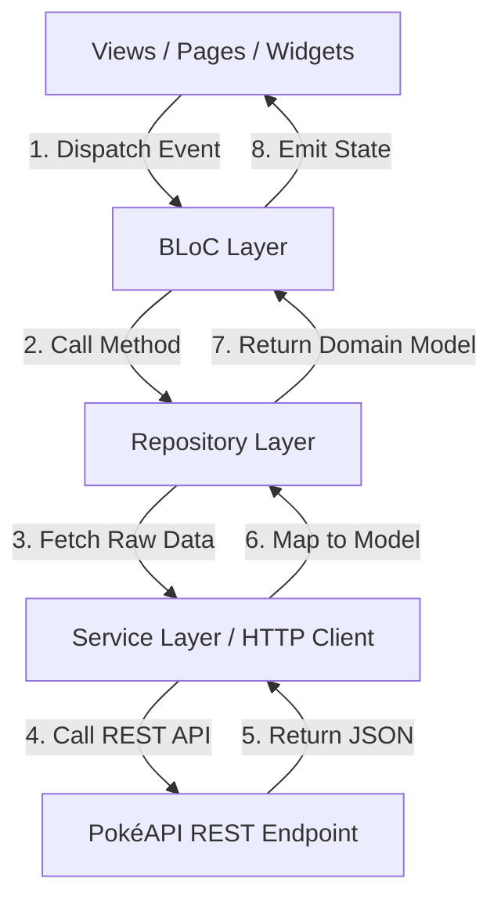

# 🐾 Pokémon Application (`my_poke_app`)

แอปพลิเคชันค้นหาและแสดงข้อมูลโปเกมอนแบบเรียลไทม์ พัฒนาด้วย **Flutter** ตามสถาปัตยกรรม **BLoC Pattern + Repository Pattern (Best Practice Architecture)** ตกแต่งด้วย **`shadcn_ui`** และจัดการระบบเส้นทางด้วย **`go_router`**


---

## 📌 สารบัญสำหรับนักพัฒนา (Table of Contents)
- [ภาพรวมโปรเจกต์ (Project Overview)](#-ภาพรวมโปรเจกต์-project-overview)
- [สถาปัตยกรรมและโครงสร้างไฟล์ (Architecture & Directory Structure)](#-สถาปัตยกรรมและโครงสร้างไฟล์-architecture--directory-structure)
- [ผังการไหลของข้อมูล (Data Flow Architecture)](#-ผังการไหลของข้อมูล-data-flow-architecture)
- [เทคโนโลยีและแพ็กเกจที่ใช้ (Tech Stack & Dependencies)](#-เทคโนโลยีและแพ็กเกจที่ใช้-tech-stack--dependencies)
- [การเริ่มต้นพัฒนาต่อ (Developer Quick Start)](#-การเริ่มต้นพัฒนาต่อ-developer-quick-start)
- [คู่มือการพัฒนาสำหรับทีม (Developer Guidelines)](#-คู่มือการพัฒนาสำหรับทีม-developer-guidelines)

---

## 🌟 ภาพรวมโปรเจกต์ (Project Overview)

แอปพลิเคชันนี้ออกแบบมาเพื่อค้นหาข้อมูลโปเกมอน เชื่อมต่อ API จริงจาก **[PokéAPI](https://pokeapi.co/)** โดยเน้นความคมชัดของโค้ด การแยกส่วนประกอบ (Separation of Concerns) เพื่อให้เพื่อนร่วมทีมสามารถเข้ามาอ่านโค้ดและพัฒนาฟังก์ชันใหม่ต่อได้ง่ายทันที

---

## 📁 สถาปัตยกรรมและโครงสร้างไฟล์ (Architecture & Directory Structure)

โปรเจกต์นี้ใช้การจัดโครงสร้างแบบ **Layer-First + BLoC + Repository Pattern** เพื่อแยกความรับผิดชอบของชั้นข้อมูล (Data), ธุรกิจ (Business Logic) และการแสดงผล (UI):

```text
my_poke_app/
├── android/
├── ios/
├── web/
├── pubspec.yaml                 # ระบุ Dependencies: shadcn_ui, go_router, flutter_bloc, http, etc.
└── lib/
    ├── app/                     # ⚙️ [1] App Configuration & Theme ส่วนกลาง
    │   └── config/
    │       ├── app_routes.dart  # ประกาศเส้นทาง Routing ทั้งหมดด้วย GoRouter (ShellRoute, Path Parameters)
    │       └── app_theme.dart   # ประกาศ Theme สไตล์ Shadcn UI (Zinc Light / Dark Mode)
    │
    ├── models/                  # 📦 [2] Data Classes & Deserialization
    │   └── pokemon.dart         # PokemonListItem, PokemonDetail (แปลง JSON + ดึงภาพ Official Artwork)
    │
    ├── services/                # 🌐 [3] Low-Level Network & Storage Services (ติดต่อ API/Storage โดยตรง)
    │   ├── poke_api_service.dart   # HTTP Client ยิงขอข้อมูลจาก PokéAPI (fetchPokemonList, fetchPokemonDetail)
    │   ├── auth_api_service.dart   # Mock Authentication REST API Calls
    │   └── local_storage_service.dart # จัดการ Session Storage / Auth Token ในเครื่อง
    │
    ├── repositories/            # 🏛️ [4] Repository Layer (Abstract Data Access & Caching)
    │   ├── pokemon_repository.dart # คนกลางรวบรวมข้อมูลโปเกมอนจาก Service
    │   └── auth_repository.dart    # คนกลางจัดการสิทธิ์และการล็อกอิน
    │
    ├── blocs/                   # ⚡ [5] State Management Layer (Flutter BLoC)
    │   ├── pokemon/             # PokemonBloc, PokemonEvent, PokemonState (ควบคุม State รายชื่อ/รายละเอียด)
    │   └── auth/                # AuthBloc, AuthEvent, AuthState (ควบคุม State สถานะการล็อกอิน)
    │
    ├── views/                   # 🎨 [6] Presentation Layer (UI Component & Screens)
    │   ├── main_tree.dart       # Shell Container สำหรับ Bottom Navigation Bar (Material 3 NavigationBar)
    │   │
    │   ├── widgets/             # 🧩 Shared Reusable UI Components (ใช้ซ้ำได้ทั้งแอป)
    │   │   ├── pokemon_card.dart      # การ์ดแสดงผลโปเกมอนแต่ละตัวใน Grid
    │   │   ├── stat_progress_bar.dart # แถบ Progress Bar แสดงค่าพลัง Base Stats
    │   │   ├── loading_indicator.dart # ตัวหมุนโหลดข้อมูลแบบ centered
    │   │   └── empty_placeholder.dart # เพลสโฮลเดอร์หน้ากำลังพัฒนา (Under Construction)
    │   │
    │   └── pages/               # Screens / Pages ทั้งหมดของแอปพลิเคชัน
    │       ├── auth/
    │       │   ├── login_page.dart     # หน้า Login สไตล์ Web Card (ShadCard, ShadInput, ShadToast)
    │       │   └── register_page.dart  # หน้า Register เทรนเนอร์ใหม่
    │       ├── home/
    │       │   ├── home_page.dart      # หน้าแรกแสดง Grid รายชื่อโปเกมอน (#001 Bulbasaur)
    │       │   └── detail_page.dart    # หน้าแสดงสเปกความสูง/น้ำหนัก, ประเภท (ShadBadge) และ Base Stats
    │       ├── search/          # หน้าค้นหาโปเกมอน (Placeholder)
    │       ├── favorites/       # หน้าโปเกมอนโปรด (Placeholder)
    │       ├── profile/         # หน้าโปรไฟล์เทรนเนอร์ พร้อมปุ่ม Sign Out ผ่าน AuthBloc
    │       └── settings/        # หน้าตั้งค่าแอปพลิเคชัน (Placeholder)
    │
    └── main.dart                # 🚀 [7] Entry Point หลัก (ตั้งค่า MultiRepositoryProvider & MultiBlocProvider)
```

---

## 🔄 ผังการไหลของข้อมูล (Data Flow Architecture)

เมื่อเกิดการทำงานในแอป ข้อมูลจะไหลเป็นวงรอบแบบทางเดียว (Unidirectional Data Flow):



---

## 🛠️ เทคโนโลยีและแพ็กเกจที่ใช้ (Tech Stack & Dependencies)

- **UI System**: [`shadcn_ui`](https://pub.dev/packages/shadcn_ui) + [`lucide_icons`](https://pub.dev/packages/lucide_icons)
- **State Management**: [`flutter_bloc`](https://pub.dev/packages/flutter_bloc) + [`equatable`](https://pub.dev/packages/equatable)
- **Navigation & Deep Linking**: [`go_router`](https://pub.dev/packages/go_router)
- **Networking**: [`http`](https://pub.dev/packages/http)
- **Data Source**: [PokéAPI](https://pokeapi.co/) & GitHub Raw Official Artwork Sprites Repository

---

## 💻 การเริ่มต้นพัฒนาต่อ (Developer Quick Start)

### 1. เครื่องมือที่ต้องมีก่อน (Prerequisites)
- [Flutter SDK](https://docs.flutter.dev/get-started/install) (เวอร์ชัน 3.20.0 ขึ้นไป)
- [Dart SDK](https://dart.dev/get-dart) (เวอร์ชัน 3.12.0 ขึ้นไป)

### 2. ขั้นตอนการติดตั้งโปรเจกต์
```bash
# 1. คลองโปรเจกต์มาจาก GitHub
git clone https://github.com/tophbeifong123/frontend_prototype.git
cd frontend_prototype

# 2. ติดตั้ง Dependencies ทั้งหมด
flutter pub get

# 3. รันการตรวจสอบ Static Code Analysis (ต้องขึ้น 0 issues)
flutter analyze

# 4. รัน Unit & Widget Tests
flutter test

# 5. สั่งรันแอปพลิเคชัน
flutter run
```

---

## 📘 คู่มือการพัฒนาสำหรับทีม (Developer Guidelines)

หากเพื่อนในทีมต้องการเพิ่มฟังก์ชันใหม่ ให้ทำตามแนวทางนี้เพื่อรักษามาตรฐานของโปรเจกต์:

### 1. การเพิ่มหน้าใหม่ (New Screen):
1. สร้างไฟล์หน้าจอใน `lib/views/pages/<category>/<page_name>.dart`.
2. หากมี Widget ที่ใช้ซ้ำได้ในหลายหน้า ให้ดึงออกมาไว้ใน `lib/views/widgets/`.
3. เพิ่ม Route ใหม่ลงใน [`lib/app/config/app_routes.dart`](file:///D:/frontend_prototype/lib/app/config/app_routes.dart).

### 2. การเพิ่ม State / Logic ใหม่ (New Business Logic):
1. **Service**: เขียนคำสั่งเชื่อมต่อ API / Storage ใน `lib/services/`.
2. **Repository**: เพิ่มเมธอดใน `lib/repositories/` เพื่อจัดการข้อมูล.
3. **BLoC**: 
   - เพิ่ม Event ใน `lib/blocs/<feature>/<feature>_event.dart`.
   - เพิ่ม State ใน `lib/blocs/<feature>/<feature>_state.dart`.
   - จัดการ Logic ใน `lib/blocs/<feature>/<feature>_bloc.dart`.
4. **Main.dart**: หากเป็น BLoC ใหม่ ให้ลงทะเบียนที่ `MultiBlocProvider` ใน [`lib/main.dart`](file:///D:/frontend_prototype/lib/main.dart).

### 3. มาตรฐานการ Commit (Git Commit Conventions):
- `feat:` เพิ่มฟีเจอร์หรือหน้าจอใหม่ (เช่น `feat: add pokemon search filter`)
- `fix:` แก้ไขบั๊ก (เช่น `fix: correct stats progress bar calculation`)
- `refactor:` ปรับปรุงโครงสร้างโค้ดโดยไม่เปลี่ยนผลลัพธ์ (เช่น `refactor: extract PokemonCard into shared widget`)
- `docs:` อัปเดตเอกสาร (เช่น `docs: update README for team onboarding`)
